# 使用手册

[TOC]

## 项目背景

随着物联网技术的迅猛发展，物联网设备的管理变得愈发重要。为了应对这一挑战，本实验旨在利用先进的Web开发技术，打造一个功能全面的物联网设备管理平台。该平台的设计目标是实现用户友好的操作界面，并提供以下基本功能：该平台用户登录后可以自行调整个人信息和物联网设备配置，可以查看设备信息的可视化界面，包括设备的运动轨迹和统计数据。

本项目致力于建立用户友好的网站界面，为用户打造良好的使用体验。此外，我们也将提供相关的软件项目文档，以帮助用户了解和掌握整套 Web 应用开发技术及其流程。

## 功能概述

该项目对于每一个用户，有如下功能：

- 用户注册、登录，及其信息验证。
- 物联网设备配置，可以自由创建和修改设备信息。
- 设备信息统计及可视化
- 设备位置信息展示，告警和正常信息的区分
- 系统首页的统计信息图表展示

根据功能划分，整个项目可以被分为：**登录注册模块、首页信息展示模块、个人信息模块、设备配置模块、数据查询模块、设备轨迹查询模块**。

### 登录注册模块

该模块提供用户的登录与注册功能。任何未经授权的访问都会被重定向至登录页面。登录成功之后将会在页面 Header 部分展示`退出登录`按钮。

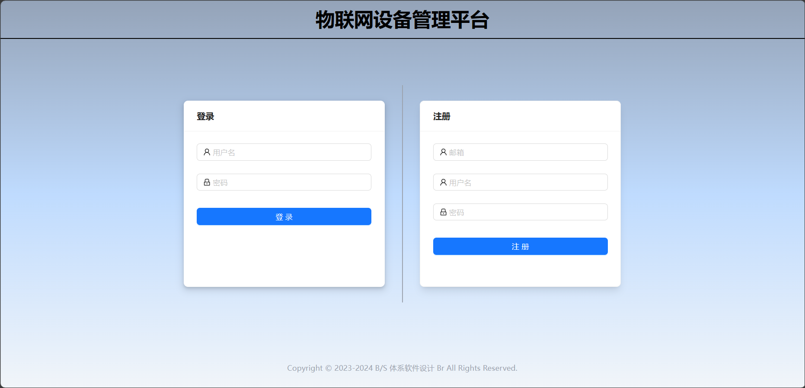

本模块提供的功能：

- 新用户注册
- 用户登录
- 退出登录

### 首页信息展示模块

该模块提供该用户所拥有设备的信息概述，并有图标统计展示数据。

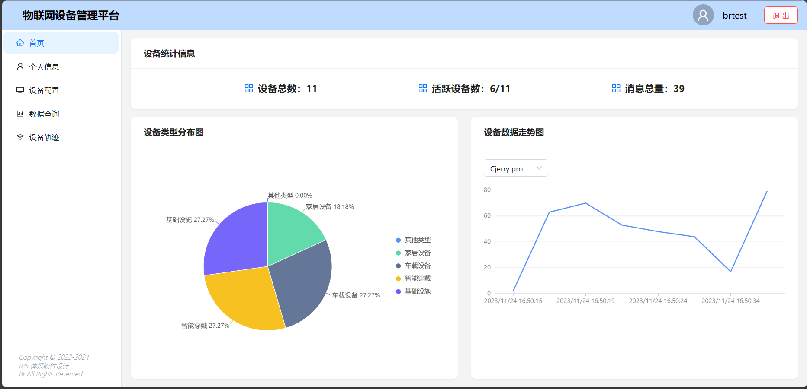

本模块提供的功能：

- 统计用户的设备数、活跃设备数、消息数
- 饼图展示用户设备类型状况
- 折线图展示用户设备数据接收趋势

### 个人信息模块

该模块展示用户的个人信息，并提供修改个人信息和密码的功能。

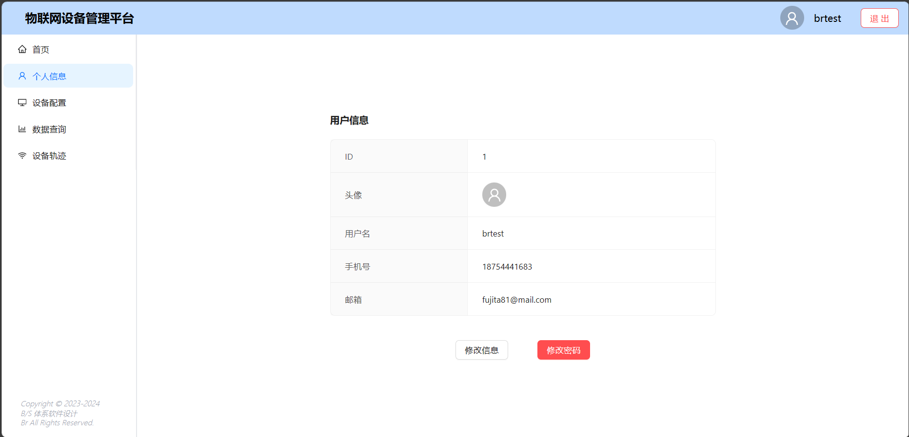

本模块提供的功能：

- 查看用户个人信息
- 修改用户个人信息
- 修改用户登录密码

### 设备配置模块

该模块展示了用户拥有的所有设备，并允许用户添加设备以及对已有设备进行修改。

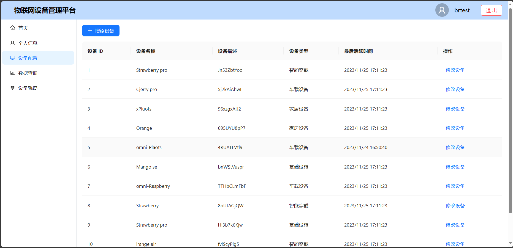

本模块提供的功能：

- 表格展示用户拥有的所有设备及其信息
- 手动添加新的设备
- 修改某台设备的信息

### 数据查询模块

该模块展示了所属用户的某台设备接收到的所有信息。

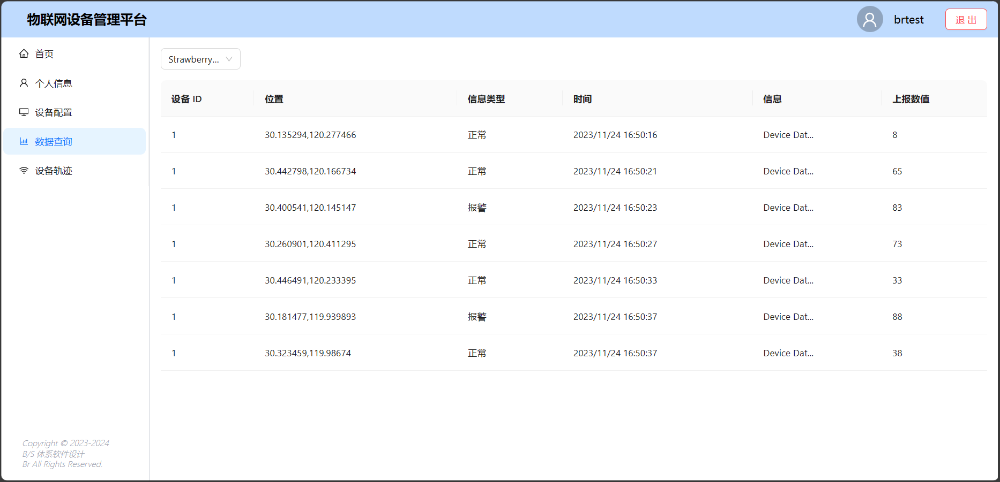

本模块提供的功能：

- 查询某台设备上报的所有信息

### 设备轨迹查询模块

该模块展示了所属用户的某台设备的运行轨迹（仅显示最近的八条信息）。

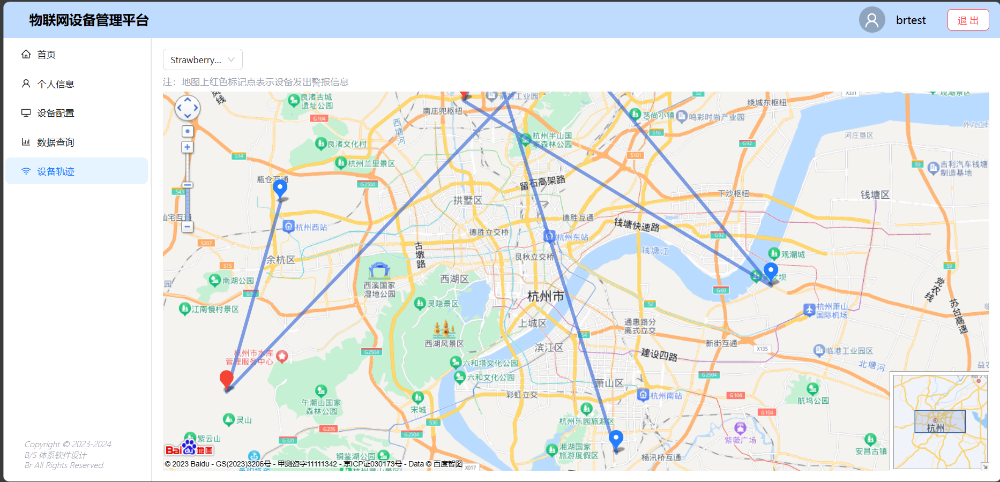

本模块提供的功能：

- 展示某台设备的运行轨迹

## 功能使用演示

本文档将根据模块划分进行功能演示。

### 登录注册模块

#### 注册账号

输入合法的邮箱、用户名（不少于 6 字节）、密码（不少于 6 字节）即可进行注册。

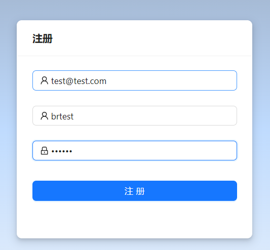

请注意，已注册的邮箱和用户名不可再次注册。

注册成功后会弹出提示，此时使用刚注册的账号在左侧进行登录即可

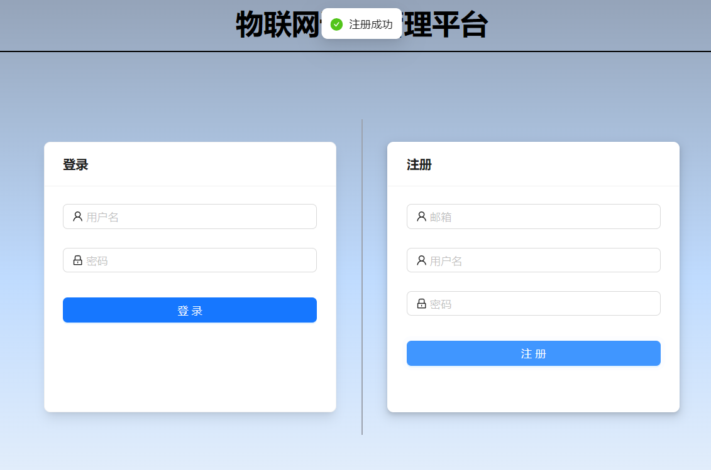

#### 登录账号

使用已经注册的用户名和密码进行登录。登录成功之后将会进入首页。

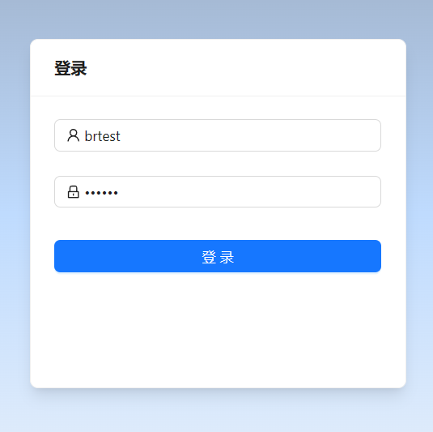

#### 退出登录

登录成功之后，可以在页面 Header 部分点击`退出`按钮退出登录。

退出登录之后将会删除本地 token 并重定向至登录界面。

### 首页信息展示模块

#### 统计信息展示

如图，首页展示了：

- 设备统计信息（设备总数、活跃设备数、消息总量）
- 设备类型分布图
- 设备数据走势图（可更改查询设备）

### 个人信息模块

#### 个人信息展示

如图，个人信息页面展示了账号的个人信息，包含：

- ID
- 头像
- 用户名
- 手机号
- 邮箱

#### 修改个人信息

点击`修改信息`按钮即可在弹窗中修改个人信息。

修改信息时需要提供合法的用户名（不少于 6 字节）、手机号（合法手机号格式）、邮箱（合法邮箱格式）。

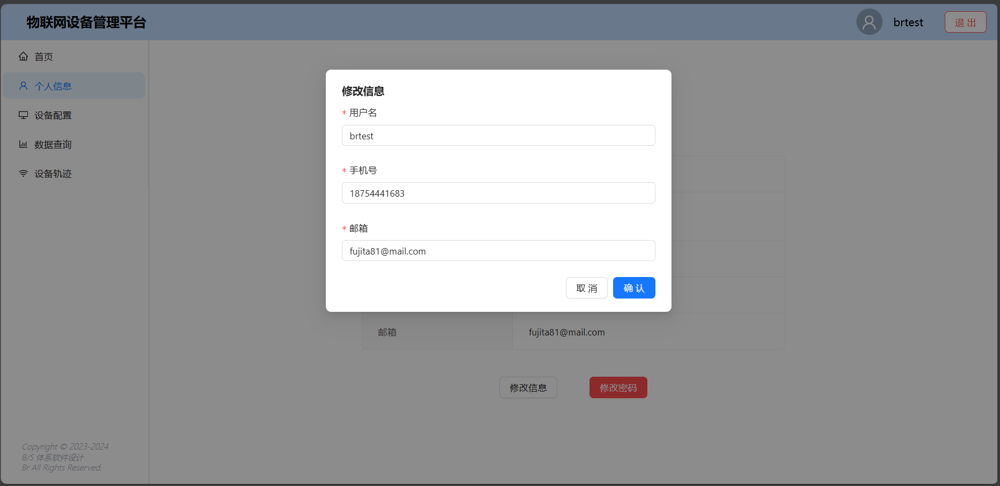

修改成功之后将会有提示

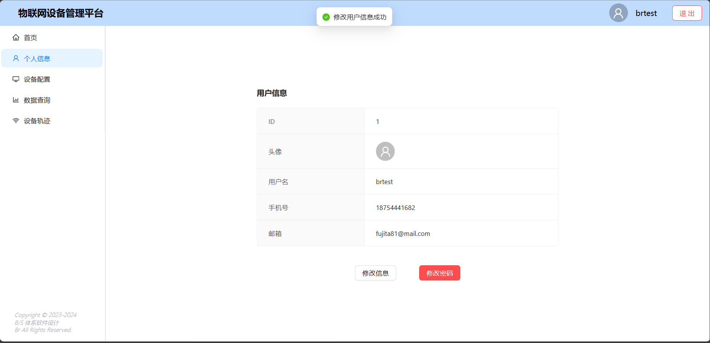

#### 修改密码

点击`修改密码`按钮即可在弹窗中修改密码。

请注意，需要输入正确的旧密码，且二次输入的确认密码需要与新密码一致，新密码也需要合法（大于 6 字节）。

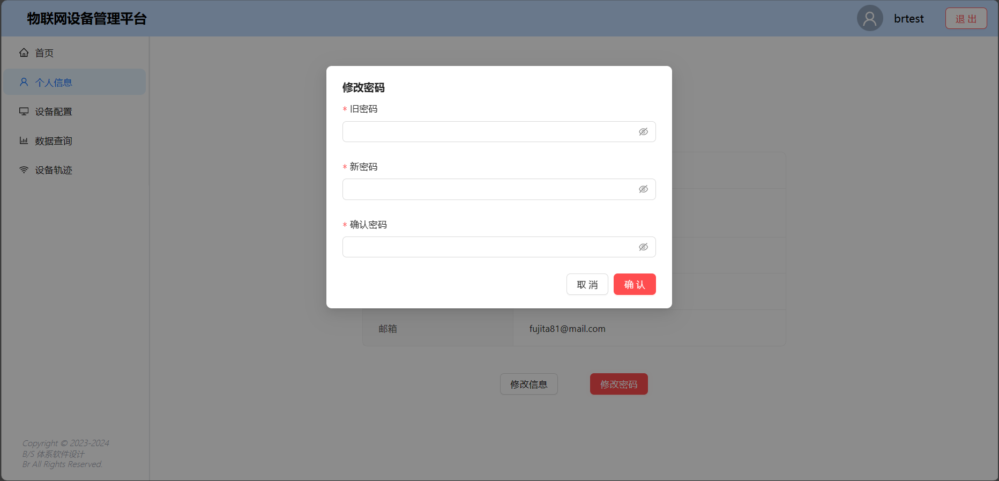

修改成功之后将会有提示

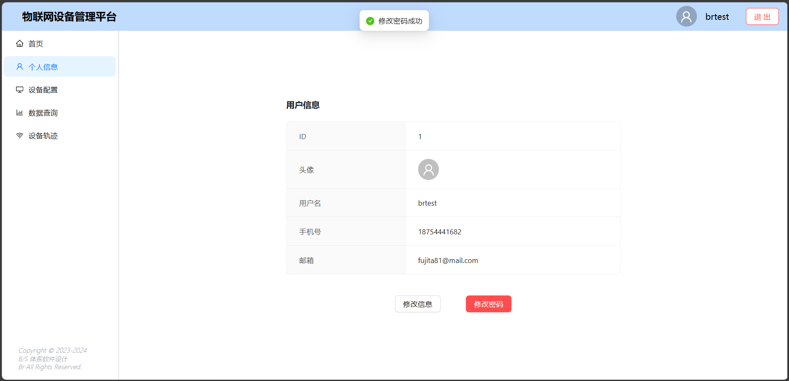

### 设备配置模块

#### 设备信息展示

如图，设备配置页面以表格的形式展示了用户拥有的所有设备，对于每一台设备，有：

- 设备 ID
- 设备名称
- 设备描述
- 设备类型
- 最近活跃时间（最新消息到达时间）

#### 增添设备

点击`增添设备`按钮，即可呼出增添设备表单。

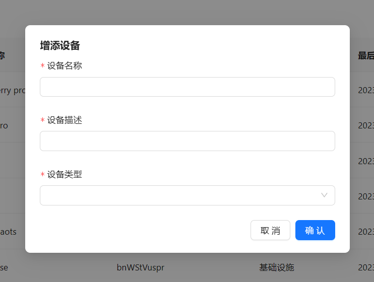

目前共有五种设备类型：

- 家居设备
- 车载设备
- 智能穿戴
- 基础设施
- 其他类型

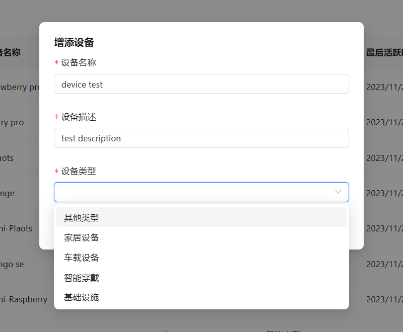

添加成功之后将会有提示

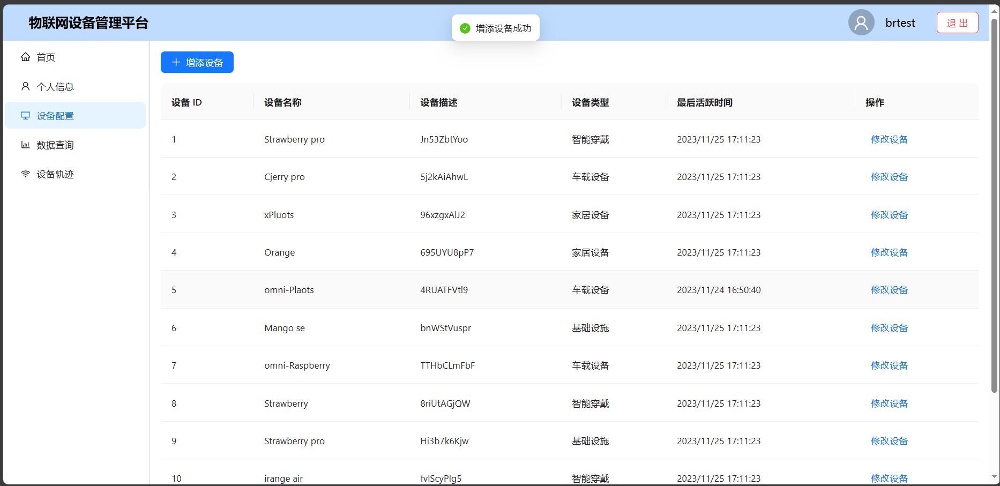

#### 修改设备

点击某一列的`修改设备`按钮，即可呼出修改设备的弹窗。

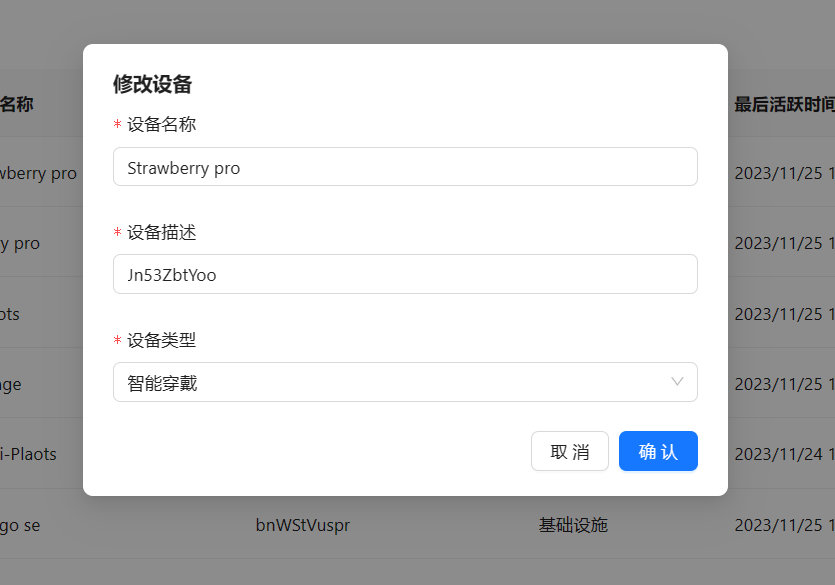

修改成功之后将会有提示

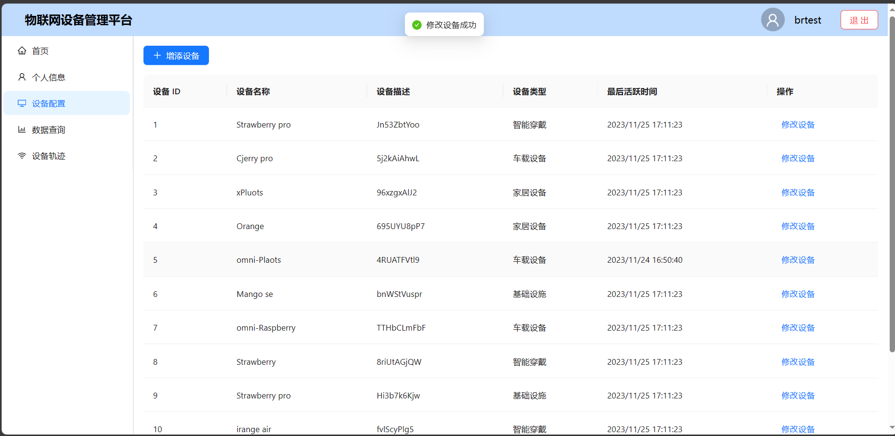

### 数据查询模块

#### 数据信息展示

如图，数据查询模块展示了某台设备所收到的所有信息，包括：

- 设备 ID
- 位置
- 信息类型
- 时间
- 信息内容
- 上报数值

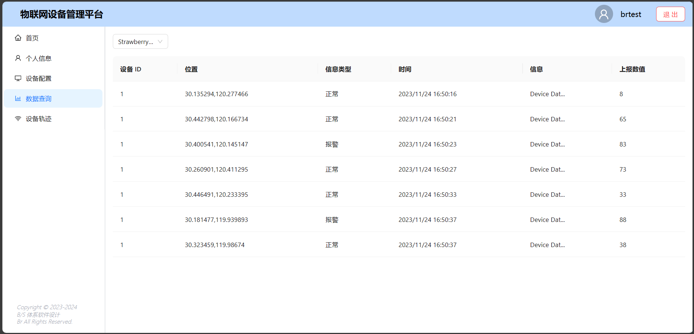

具体信息有悬浮展示

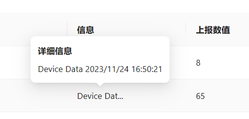

左上角可选择查看的设备

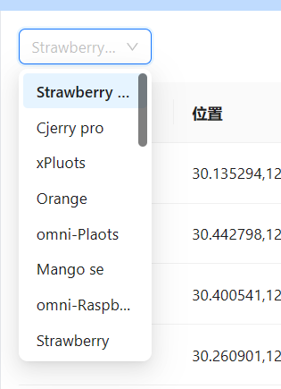

### 设备轨迹查询模块

#### 轨迹展示

如图，设备轨迹查询模块展示了某台设备的最近轨迹（展示最近八条信息的轨迹）

鼠标悬浮坐标点会有信息详细内容展示。

左上角可以切换查看的设备：

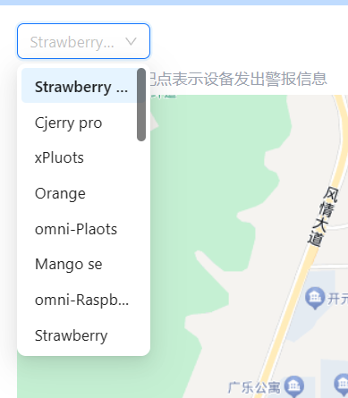