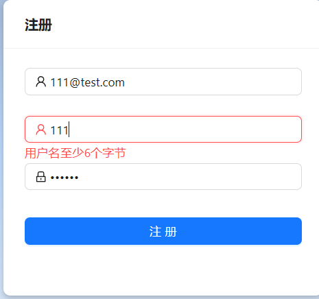

# 测试报告

[TOC]

> 注：本报告仅测试项目的**非正常使用**。正常使用的情况请参见《用户手册》

## 登录模块

### 空输入

当表单提交时未输入足够的信息时，应当阻止表单提交并提醒用户。

### 错误的信息

当用户输入不存在的用户名时，页面表单应当拦截登录并提醒用户。

当用户输入错误的密码时，页面表单应当拦截登录并提醒用户。

### 退出登录

经过测试，用户退出登录后会返回登录页面，并清除页面留存的 token

### 未登录状态访问

项目不允许在未登录的情况下进行访问，任何未经授权的访问都会被重定向至登录页面

## 注册模块

### 空输入

当表单提交时未输入足够的信息时，应当阻止表单提交并提醒用户。

### 不符合规则的输入

用户名的长度至少为 6 个字节，否则表单将会提醒用户

密码的长度至少为 6 个字节，否则表单会提醒用户

用户的邮箱必须符合邮箱格式，否则表单会提醒用户

### 已经注册的用户名或邮箱

已经注册过的用户名无法注册

已经注册过的邮箱无法注册

## 首页

### 数据显示测试

经验证，首页的数据显示与数据库内的显示一致

## 个人信息页面

### 不符合格式地修改个人信息

修改后的用户名不得小于6个字节

修改后的手机号需要满足手机号的基本格式

修改后的邮箱需要满足邮箱的基本格式

### 错误的旧密码

使用错误的旧密码将会提醒旧密码输入错误

### 新密码少于 6 个字节

新密码不得少于 6 个字节，否则表单将会提醒用户

### 两次密码输入不一致

新密码与确认密码需要一致，否则表单将会提醒用户。

## 设备配置页面

### 增添设备表单空输入

当表单提交时未输入足够的信息时，应当阻止表单提交并提醒用户。

### 修改设备表单空输入

当表单提交时未输入足够的信息时，应当阻止表单提交并提醒用户。

## 数据查询页面

### 数据显示测试

经验证，数据查询页面的数据显示与数据库内的显示一致

## 设备轨迹页面

### 数据显示测试

经验证，设备轨迹页面的数据显示与数据库内的显示一致

## 总结

本次测试主要对基本完成开发的物联网应用网站进行了一系列的测试，测试结果表明网站不存在严重的或者较明显的 bug，基本功能需求全部实现，符合项目预期。