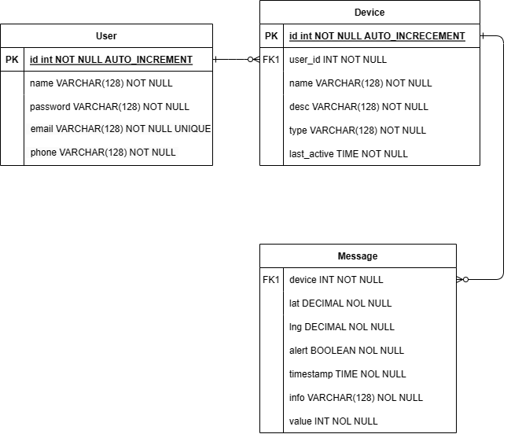

# 物联网设备管理平台设计报告

## 项目背景

随着物联网技术的迅猛发展，物联网设备的管理变得愈发重要。为了应对这一挑战，本实验旨在利用先进的Web开发技术，打造一个功能全面的物联网设备管理平台。该平台的设计目标是实现用户友好的操作界面，并提供以下基本功能：该平台用户登录后可以自行调整个人信息和物联网设备配置，可以查看设备信息的可视化界面，包括设备的运动轨迹和统计数据。

本项目致力于建立用户友好的网站界面，为用户打造良好的使用体验。此外，我们也将提供相关的软件项目文档，以帮助用户了解和掌握整套 Web 应用开发技术及其流程。

本文档为项目的系统设计文档，涵盖了需求分析、技术选型、系统环境、数据库表设计、接口设计等内容，详细展示了物联网设备应用网站的设计情况。

该项目要求包含完整的 Web 前后端、MQTT 服务器以及相关项目文档，并且由单一人员独立完成。


## 需求分析

### 功能需求

对于每一个用户，需要有如下功能性需求：

- 用户注册、登录，及其信息验证。
- 物联网设备配置，可以自由创建和修改设备信息。
- 设备信息统计及可视化
- 设备位置信息展示，告警和正常信息的区分
- 系统首页的统计信息图表展示

其中每个功能下还有若干子功能，比如用户信息需要支持修改等等。

### 非功能需求

非功能需求包括性能需求、输入输出需求、数据管理需求等等。

#### 性能需求

系统需要满足以下基本性能需求：

- 系统运行保证总体稳定流畅
- 页面适配所有主流浏览器
- 系统支持百人级别的并发访问
- 用户的操作后的系统反应时长控制在 1s 以内
- 系统可以及时检测并反馈出现的各种异常情况

#### 输入输出需求

- 在用户输入账号密码时，应对数据输入进行数据有效性检查，确保其安全性
- 设备的运动轨迹和统计信息需以可视化的图标等方式呈现
- 系统应通过程序控制出错几率，减少系统因用户人为的错误引起的破坏

#### 数据管理需求

- 系统需要保证其独立性的同时，具备和其他系统进行交互的能力
- 系统应防止未经授权的各类人员对本系统进行设置和修改或访问系统内部数据
- 系统服务器软件必须提供可靠的数据备份和恢复手段，在服务器软件或硬件出现严重故障时，能够根据备份的数据和账户信息迅速恢复正常运行环境
- 除此之外，系统应具备加密登录、数据加密传输等安全方面的保障，保证数据在不用系统间传输过程中的保密性与安全性


## 技术选型

### 总体技术选型

本项目使用前后端分离的 Web 开发。通过由后端提供 API 调用，前端调用 API 来实现用户和系统数据之间的沟通。同时，系统中将会有一个MQTT 服务器用于模拟物联网客户端接收和处理数据并和数据库交互，整个项目的技术选型如下：

- 前端：以 React 框架 Next.js 作为核心，使用 Typescript 和 Eslint 技术进行辅助开发，使用 SWR 进行数据请求，页面设计和组件使用中使用 AntD 以及 TailwindCSS。同时使用百度地图 API 作为地图显示的辅助。
- 后端：以 SpringBoot 为核心，辅以 Maven 进行包管理。使用 Mybatis 与 MySQL 进行数据库的相关处理。
- 物联网：使用 Python + Paho 库来进行物联网相关的模拟和数据流通

### 主要技术介绍

#### 前端技术

React是一个由Facebook开发的JavaScript库，用于构建用户界面。它主要用于构建单页面应用程序（SPA），其中用户与页面交互时，只更新页面的一部分，而不是整个页面重新加载。React的核心思想是通过组件化的方式构建用户界面，使代码更具可维护性和可重用性。

Next.js是一个React框架，它简化了React应用的开发过程并提供了服务器渲染和静态生成等性能优化功能。通过Next.js，可以轻松实现页面路由、自动代码拆分以提高加载速度，并享有内置的CSS支持。它还简化了服务器端渲染（SSR）的实现，使得构建快速、可扩展的React应用变得更加容易。

SWR（Stale-While-Revalidate）是一个React Hooks库，用于数据获取和缓存。它通过在组件渲染时返回缓存的数据，然后在后台重新获取最新数据，从而实现了快速显示旧数据，并在后台更新以确保数据的新鲜性。SWR还提供了一些优化策略，例如自动重试和缓存过期，使数据获取变得简单而高效。它特别适用于构建React应用程序中的数据层，提供了简洁而强大的工具来处理数据的获取和管理。

Ant Design（AntD）是一个由阿里巴巴设计团队开发的React组件库，旨在提供美观、实用的UI组件和设计规范。AntD的组件丰富而灵活，覆盖了各种常见的Web应用场景，包括表单、表格、导航等。通过AntD，开发者可以快速构建现代化的用户界面，同时保持一致的设计风格。AntD还提供了丰富的文档和社区支持，使其成为许多React开发者的首选UI库。

百度地图 SDK 是百度开发的一款基于百度地图的前端开发工具包，并提供了对 React 的支持，百度地图 SDK 提供了地图组件，并且可以在地图中进行点和线的标注和绘制，可以用于设备位置的可视化。

#### 后端技术

Spring Boot是基于Spring框架的一个简化、约定优于配置的开发框架，旨在快速搭建基于Java的生产级别的应用程序。它通过默认配置和自动化，简化了Spring应用的开发过程，使开发者能够更专注于业务逻辑而不必过多关注配置细节。Spring Boot提供了内嵌的Web服务器、丰富的起步依赖、自动化配置等特性，使得构建和部署Java应用变得更加轻松高效。

MyBatis是一个基于Java的持久层框架，它通过使用简单的XML或注解配置来映射Java对象与数据库表之间的关系。MyBatis的设计思想是提供轻量级、灵活且可定制的持久层解决方案，使开发者能够更好地控制SQL语句和数据库操作。它支持动态SQL、自动映射、缓存等特性，同时避免了大量的样板代码，简化了数据库访问的操作。MyBatis广泛应用于Java项目中，为开发者提供了一种简单而强大的数据访问方式。

MySQL 是一个流行的开源关系型数据库管理系统（RDBMS），广泛用于各种规模的应用程序开发和管理数据。从小型网站到大型企业级应用，因其稳定性、性能和开源性而备受青睐。MySQL 在数据存储和管理方面提供了强大的功能，适合不同规模和需求的项目。

#### MQTT 服务器

本项目的 MQTT 服务器采用了 mosquitto，但是因为 mosquitto 不能存储消息，因此本项目使用 Python 编写了一个服务端脚本进行了二次开发，采用 Paho 库来接收设备模拟器客户端发送过来的消息，并存储到数据库中。


### 系统环境

#### 软件环境

操作系统：Windows 7 及以上、Linux

网站服务器：Nginx

数据库服务器：Linux 端的 MySQL

浏览器：Microsoft Edge

#### 硬件环境

CPU：i5 及以上

内存：2GB

硬盘：500GB

网络：具有良好的数据传输能力


## 数据库表设计

### 数据表

本系统设计了三张数据表，分别用于储存用户信息、设备信息、设备状态信息。

#### User 表

| 字段     | 类型         | 描述                | 备注         |
| -------- | ------------ | ------------------- | ------------ |
| id       | INT          | 用户 ID             | 自增、主键   |
| name     | VARCHAR(128) | 用户名              | 非空         |
| password | VARCHAR(128) | 用户密码（已 hash） | 非空、UNIQUE |
| email    | VARCHAR(128) | 邮箱                | 非空、UNIQUE |
| phone    | VARCHAR(128) | 手机号              | 非空         |

#### Device 表

| 字段        | 类型         | 描述             | 备注           |
| ----------- | ------------ | ---------------- | -------------- |
| id          | INT          | 设备 ID          | 自增、主键     |
| name        | VARCHAR(128) | 设备名称         | 非空           |
| desc        | VARCHAR(128) | 设备描述         | 非空           |
| user_id     | INT          | 用户 ID          | 非空、外键     |
| type        | INT          | 设备类型         | 非空、默认为 0 |
| last_active | TIMESTAMP    | 设备上次活跃时间 | 非空           |

注：其中设备类型从 0 开始编号，分别代表：其他类型、家居设备、车载设备、智能穿戴、基础设施

#### Message 表

| 字段      | 类型         | 描述           | 备注           |
| --------- | ------------ | -------------- | -------------- |
| device_id | INT          | 设备 ID        | 外键           |
| lat       | DECIMAL      | 经度           | 非空、默认为 0 |
| lng       | DECIMAL      | 纬度           | 非空、默认为 0 |
| aleat     | BOOLEAN      | 是否触发警报   | 非空           |
| timestamp | TIMESTAMP    | 消息发出时间戳 | 非空           |
| info      | VARCHAR(128) | 发出的消息     | 非空           |
| value     | INT          | 设备上报的值   | 非空           |

### ER 图




## 接口设计

本接口设计主要用于系统的前后端交互。我们使用 SpringBoot 的路由功能监听前端发送的请求，请求和传递数据的时候均使用 JSON 格式。后端返回的数据符合 RESTFUL 格式，由前端统一使用 axios 前处理器解包。

```json
{
	"code": "0", // 0 表示未出错，同时 message 为空，其余表示出错
    "data": {
        //....
    },
    "message": "",
}
```

下方的所有返回值仅包含 `data` 部分

### 用户信息相关接口

#### 用户登录

> /api/user/login

简介：用于网站登录

参数：用户名和 hash 后的密码

返回值：一个布尔值，表示是否登录成功

#### 用户注册

> /api/user/register

简介：用于网站用户注册。由前端检测邮箱和手机号的合法性。

参数：用户名、密码、邮箱、手机号

返回值：一个布尔值，表示是否注册成功。一个 msg，表示注册失败时的原因。

#### 修改用户信息

> /api/user/update

简介：用于修改用户信息

参数：用户的所有信息（同注册），其中邮箱不允许变更

返回值：一个布尔值，表示是否修改成功

### 设备信息相关接口

#### 新增设备

> /api/device/add

简介：用于添加新的设备

参数：设备信息

返回值：一个布尔值，表示是否增添成功。一个 id，表示增添的设备 id。一个 msg，表示增添失败的原因。

#### 查询设备信息

> /api/device/info

简介：获取一台设备的所有信息

参数：设备 id

返回值：设备的所有信息

#### 修改设备信息

> /api/device/update

简介：修改设备信息

参数：设备 id。设备的其他信息。

返回值：一个布尔值，表示是否修改成功。一个 msg，表示修改失败的原因。

#### 查询用户设备

> /api/device/user

简介：查询一个用户拥有的所有设备的 id

参数：用户 id

返回值：一个列表，里面包含了用户拥有的所有设备 id

### 设备消息传输相关接口

#### 获取单个设备的所有消息

> /api/message/device

简介：获取某个设备的消息

参数：设备 id，查询的消息数量（可省略，默认 20）

返回值：某个设备的信息 Array


## 附录

### 项目进度安排

- 2023.11
  - 前半月初步完成系统设计，学习相关技术栈
  - 后半月搭建系统框架雏形
- 2023.12
  - 前半月完成系统前后端开发
  - 后半月进行系统测试，并撰写实验报告